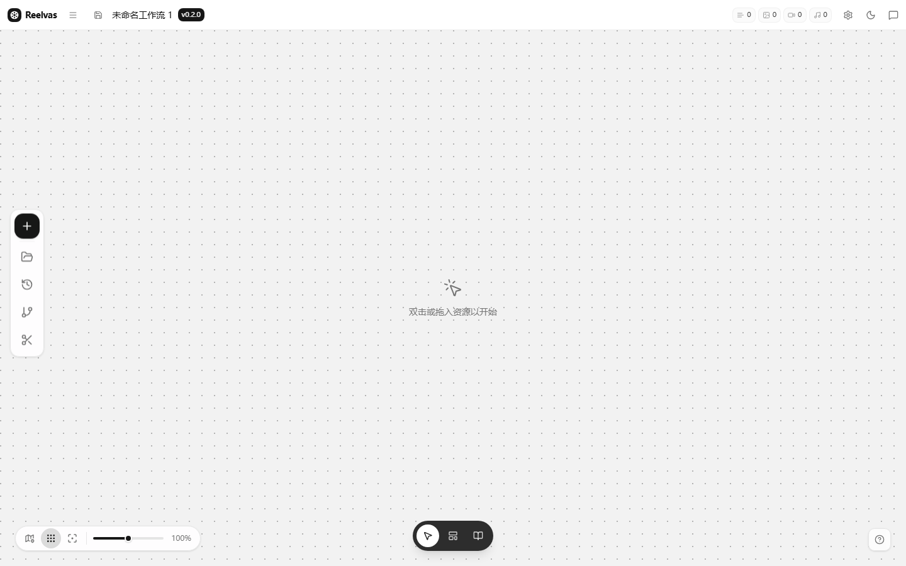
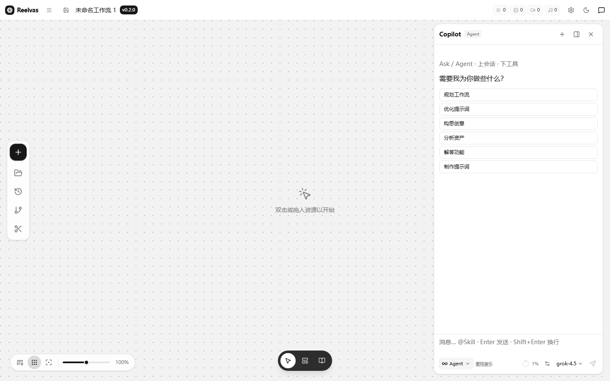
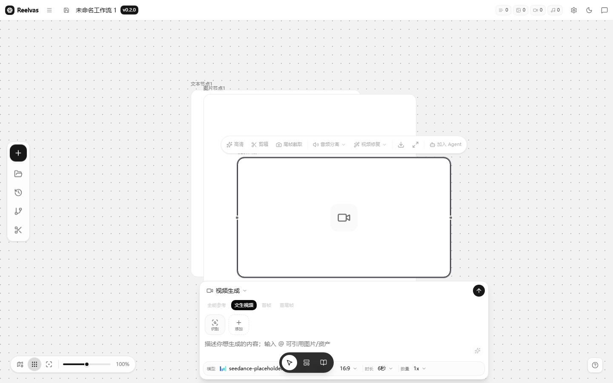
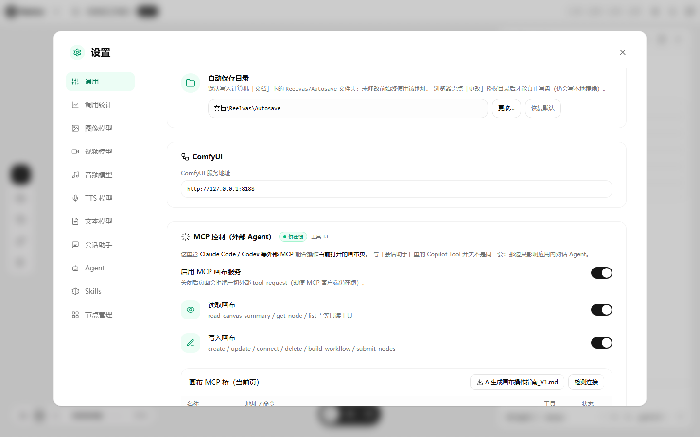
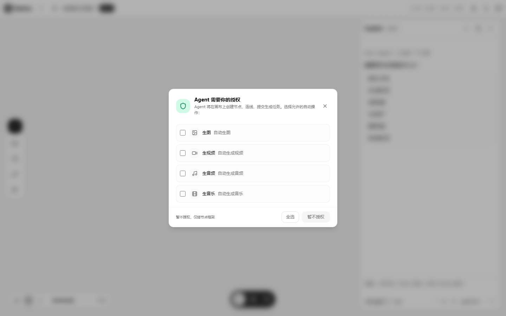
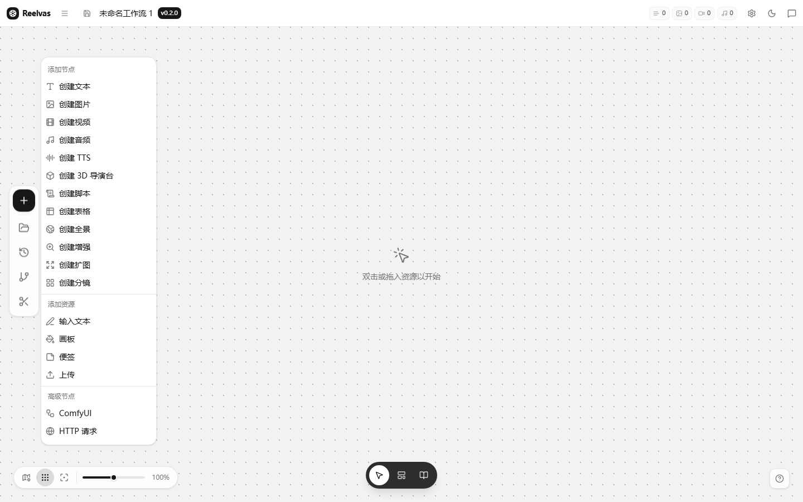
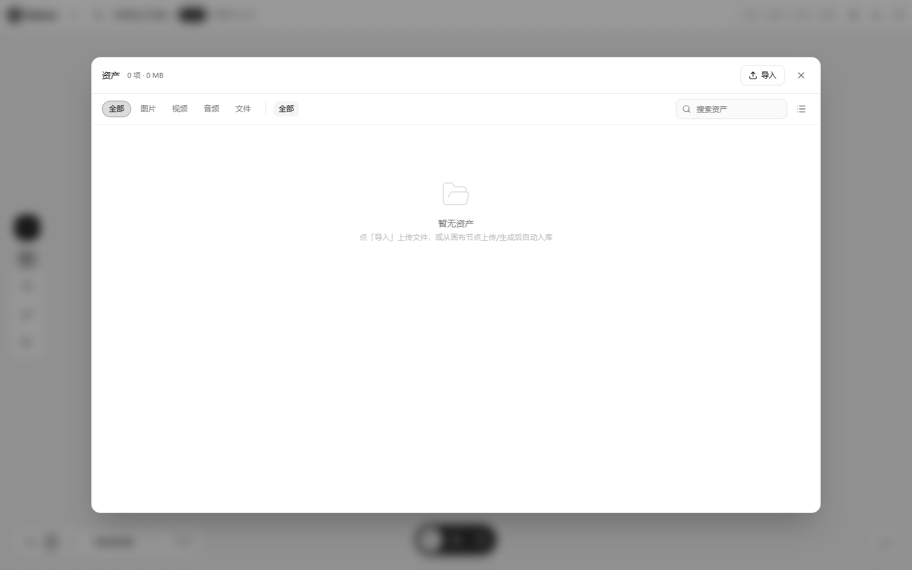
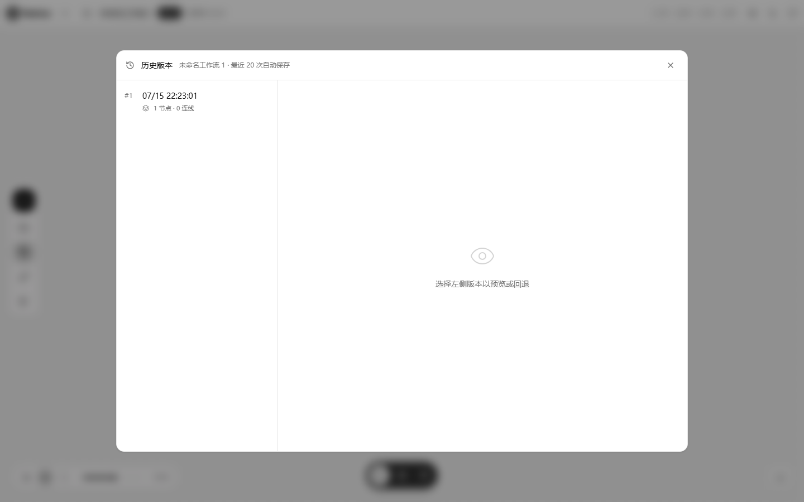
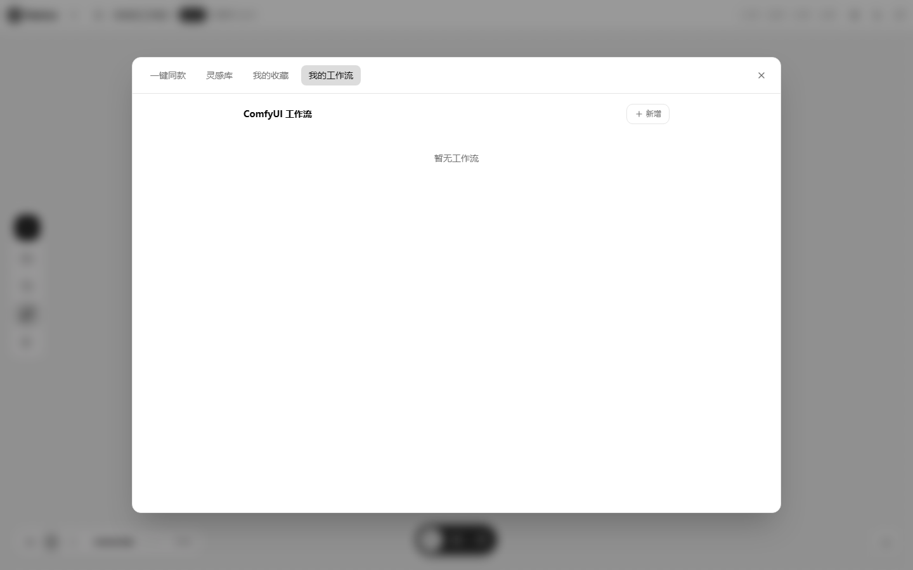
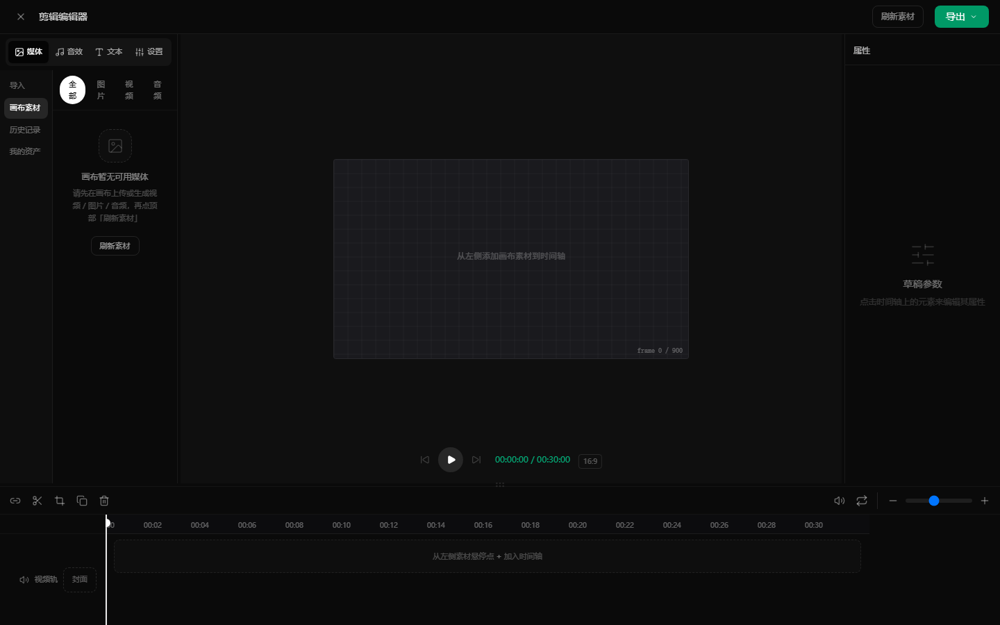

# Reelvas

**短剧 AI 无限画布** — 开源节点式创作工作台。

Reel（胶片卷）+ Canvas（画布）→ **Reelvas**：在无限画布上用节点编织短剧分镜、文案、图 / 视频 / 音频生成链路；内置 Copilot（Ask / Agent）与 **MCP 桥**，可用 Claude Code / Codex 等外部 Agent **操作当前打开的页面**。

> API Key **不会**预置在仓库中。请在设置里自行填写各模型渠道；免费 Edge TTS（`browser-tts`）无需 Key。

## ⚠️ 开源使用建议

**推荐开发者下载源码自行编译运行**，而非直接使用预编译 exe：

- 各 AI 模型 API 协议 / 网关地址**变动频繁**，作者无法保证 exe 内置默认值始终可用
- 自行编译能随时拉取仓库最新版本，第一时间获得协议适配与 bug 修复
- 建议 **定期 `git pull` 跟进主线更新**

> 📢 **QQ 交流群：894246232** — 问题反馈 · 更新通知 · 使用交流

**基础功能已完成**，部分高级功能还在持续完善中，请关注仓库更新。

## 功能亮点

| 能力 | 说明 |
|------|------|
| 无限画布 | 自研 flow 引擎：节点、连线、缩放平移、框选 |
| 多模态节点 | 文 / 图 / 视 / 音 / TTS / 分镜 / 3D 等 18 种节点 |
| Copilot | Ask 问答 · Agent 搭工作流 / 改节点参数 / 提交生成 |
| MCP 画布桥 | `scripts/mcp-canvas-server.js` 操作**当前打开页**（非离线 JSON） |
| 本地统计 | 顶栏文本 token · 图 / 视频 / 音频调用次数（不计费） |
| Electron | 可选桌面壳 + 文档目录自动保存 |

## 全部节点（18 种）

### ✅ 已实现（17 个）

| # | 节点 | 类型标识 | 说明 |
|---|------|----------|------|
| 1 | 创建文本 | `text` | AI 文本 / 对话生成，支持多模型 |
| 2 | 创建图片 | `image` | AI 图片生成，支持多图参考 + 图生图 |
| 3 | 创建视频 | `video` | AI 视频生成，支持文生 / 图生 / 首尾帧 |
| 4 | 创建音频 | `audio` | AI 音乐生成（Suno 兼容） |
| 5 | 创建 TTS | `tts` | 文字转语音，含免费 Edge 神经 TTS |
| 6 | 3D 导演台 | `3d` | 开源 3D 场景 iframe 嵌入，多机位截图回传 |
| 7 | 增强 | `upscale` | 图片超分放大，支持网络 API / 本地模型（待接入） |
| 8 | 扩图 | `outpaint` | 图片外扩 outpainting，拖边扩图 + 图生图回填 |
| 9 | 输入文本 | `input` | 文本资源节点，作为上游输入 |
| 10 | 画板 | `board` | Canvas 自由绘制画板 |
| 11 | 便签 | `note` | 便签备注，快速记录想法 |
| 12 | 上传 | `upload` | 文件 / 图片上传与预览 |
| 13 | 创建脚本 | `script` | 剧本 / 脚本生成 |
| 14 | 创建表格 | `table` | 结构化表格数据 |
| 15 | 创建全景 | `panorama` | 360° 全景图 |
| 16 | 创建分镜 | `storyboard` | 分镜格子编排 |
| 17 | ComfyUI | `comfyui` | ComfyUI 工作流集成 |

### 🚧 骨架节点（已挂载，编辑面板待补齐）

| # | 节点 | 类型标识 | 说明 |
|---|------|----------|------|
| 18 | HTTP 请求 | `http` | 外部 API / Webhook 调用 |

### 🔮 后续更新计划

| 计划 | 说明 |
|------|------|
| 分离节点 | 图片前景 / 背景分离 |
| 高清放大节点 | 专业超分辨率模型接入 |
| 视频剪辑节点 | 画布内视频裁剪与拼接 |
| Agent Tool Call | Copilot Agent 工具调用链 |
| 系统提示词 | 自定义 Agent 系统级 prompt |
| 小存储画布 ace | 画布状态轻量持久化 |
| … | 更多节点与能力持续迭代 |

## 技术栈

- Next.js 15（App Router，`output: 'export'` 静态导出）
- React 19 · Tailwind CSS v4 · TypeScript
- 自研画布引擎（`components/editor/flow/`）
- Electron 40（可选）
- MCP stdio + 本机 WebSocket 桥

## 源码编译指南

> **推荐开发者自行编译**，确保使用最新协议适配与 bug 修复。exe 内置默认值可能已过时。

### 环境要求

- **Node.js** ≥ 18（推荐 20 LTS）
- **npm** ≥ 9
- Windows / macOS / Linux

### 编译运行（3 步）

```bash
# 1. 克隆仓库
git clone https://github.com/<you>/reelvas.git
cd reelvas

# 2. 安装依赖
npm install

# 3. 构建 + 启动（含免费 TTS + MCP 画布桥）
npm run build
npm run serve:tts
# 浏览器打开 http://localhost:3000/editor/_
```

### 可选：打包桌面 exe

```bash
npm run dist
# 产物在 dist/win-unpacked/Reelvas.exe（需先执行 npm run build）
```

### 开发热更新

```bash
npm run dev   # Next.js dev server，仅 UI 热更新（不含 free TTS 落盘）
```

### 调试规则（仅 2 种有效模式）

| 模式 | 命令 | 说明 |
|------|------|------|
| serve:tts | `npm run build` → `npm run serve:tts` | 静态 `out/` + free TTS + **MCP 画布桥** |
| Electron | `npm run electron` 或 `npm run app` | 桌面壳，IPC free TTS |

> ⚠️ **禁止** `npx serve out` 等纯静态服务作为调试入口（无 `/api/free-tts`，浏览器直连 Edge TTS 会 403）。

### VS Code 插件依赖（Tailwind CSS）

`.vscode/extensions.json` 中声明了必需插件，打开项目时 VS Code 会提示安装。

## 外部 Agent（Claude Code / Codex）

1. 打开编辑器（`serve:tts` 或 Electron）
2. 配置 MCP：

```json
{
  "mcpServers": {
    "reelvas-canvas": {
      "command": "node",
      "args": ["scripts/mcp-canvas-server.js"],
      "env": { "REELVAS_BRIDGE_PORT": "3000" }
    }
  }
}
```

3. Skill 目录：
   - Claude：`.claude/skills/reelvas-canvas/`
   - Codex：`.agents/skills/reelvas-canvas/`
4. 设置 → Agent / 通用 → 可下载 `AI生成画布操作指南_V1.md`

桥地址：`ws://127.0.0.1:3000/reelvas-canvas-bridge`（与页面同源端口）。

## 截图

### 编辑器



### Copilot Agent



### 节点工作流



### MCP 控制（外部 Agent · 当前打开页）



### Agent 生成授权



### 左侧画布侧栏

| 添加节点 | 资产 |
|----------|------|
|  |  |

| 历史版本 | ComfyUI 工作流 |
|----------|----------------|
|  |  |



更多文件与配文说明见 [`docs/screenshots/README.md`](docs/screenshots/README.md)。

## 目录结构（摘要）

```
app/                    路由入口
components/editor/      编辑器 · 画布 · 节点 · Copilot · 设置
lib/                    渠道/工作流/MCP 桥/Agent 工具
scripts/                serve-with-tts · mcp-canvas-server · canvasBridgeHub
.claude/skills/         Claude Code Skill
.agents/skills/         Codex Skill
electron-main.js        桌面主进程
```

## 安全

- **不要**把 API Key 写进源码或默认渠道；本仓库默认 `apiKey: ''`
- 用户 Key 仅存浏览器 `localStorage` / 桌面本地
- MCP 桥仅监听本机，操作的是当前打开页
- 若曾误提交过 Key：请立即在网关侧**轮换作废**，并检查 git 历史

## 开源与贡献

- License：建议 MIT（若你另有选择请改 `LICENSE`）
- Issue / PR 欢迎：节点协议、MCP 工具、画布性能、无障碍
- 📢 **QQ 交流群：894246232** — 反馈问题、获取更新通知、交流使用心得
- 基础功能已可用，部分高级功能持续完善中，请关注仓库更新

## 打包产物

```bash
npm run dist
# dist/Reelvas *.exe (portable) 与 dist/win-unpacked/
```

---

**Reelvas** — 在无限画布上卷起你的短剧胶片。
